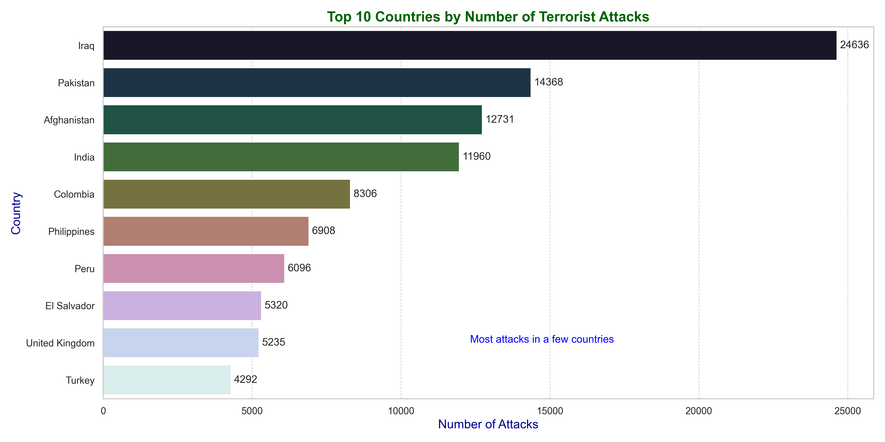
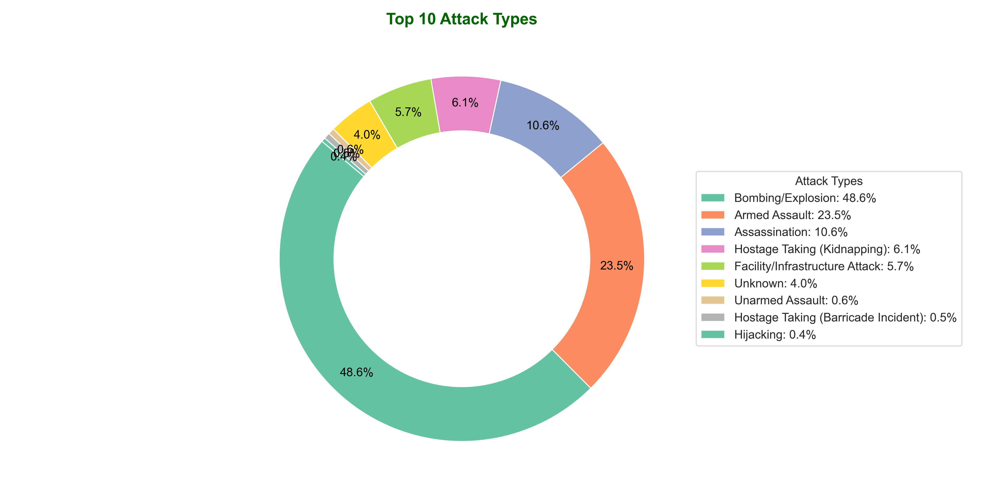

# Global Terrorism Analysis

This project presents an analysis of global terrorism using the Global Terrorism Database. The analysis is visualized through various plots to provide insights into the trends and patterns of terrorist attacks worldwide.

## Dataset

The dataset used in this analysis is the Global Terrorism Database, which can be found on Kaggle:
[Global Terrorism Database](https://www.kaggle.com/datasets/START-UMD/gtd)

## Visualizations

### 1. Number of Terrorist Attacks per Year (Line Plot)
- **Description:** This plot shows the trend of terrorist attacks over the years, highlighting an increase in the number of attacks.
- 

### 2. Number of Deaths due to Terrorist Attacks per Year (Bar Plot)
- **Description:** This plot highlights the years with the highest fatalities due to terrorist attacks.
- 

### 3. Top 10 Countries by Number of Terrorist Attacks (Horizontal Bar Plot)
- **Description:** This plot displays the countries with the most terrorist attacks, showing concentration in a few countries.
- 

### 4. Top 10 Attack Types (Pie Chart)
- **Description:** This plot highlights the most common types of terrorist attacks.
- 

## Infographic

The following infographic compiles the above plots into a single visualization:


## How to Run the Script

1. Ensure you have Python 3.11 or later installed.
2. Install the required libraries if you haven't already:
   ```bash
   pip install numpy pandas matplotlib seaborn
3. Download the dataset from the provided link and place it in the same directory as the script.
4. Run the script 22055871.py:
   ```bash
   python 22055871.py
5. The script will generate individual plot images and a combined infographic image in PNG format.
## Author
* Name: Khadiza Mahdin
* Student ID: 22055871

